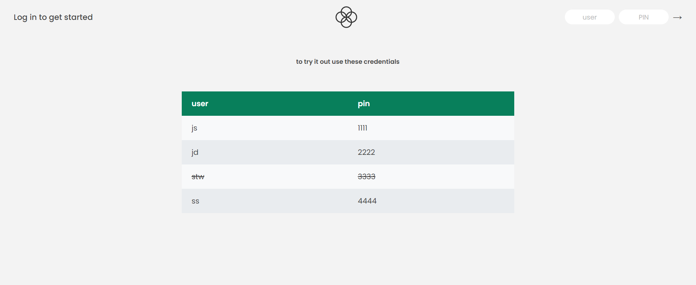
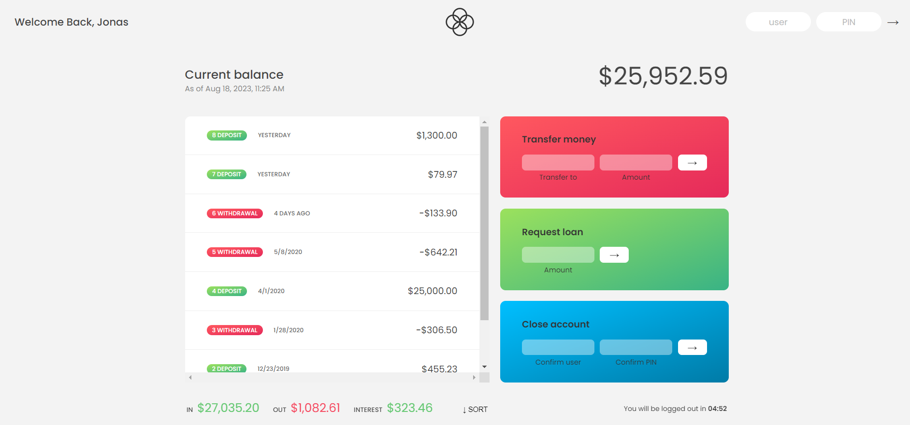
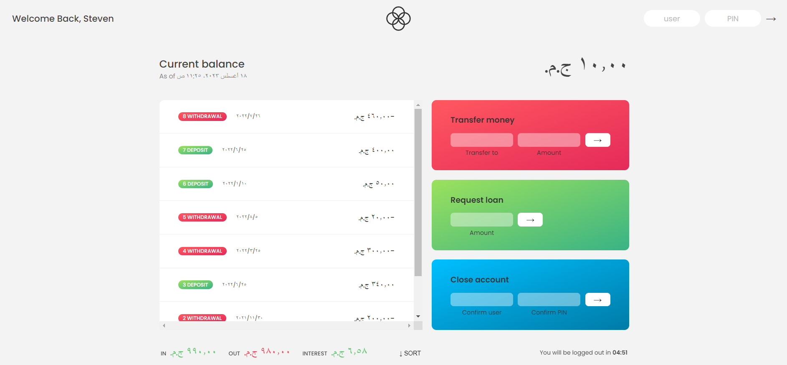

# Minimalist Banking Interface

A simple web application that simulates a minimalist Fintech Application Interface. Users can perform basic banking operations such as depositing money, transferring funds, and requesting a loan. Built using Vanilla JavaScript, HTML, and CSS.





## Features

- Authenticate with username and pin
- Deposit money into your account.
- Transfer funds between accounts.
- Request a loan.
- Minimalist and user-friendly interface.
- Built using modern web technologies.

## Getting Started

Follow these instructions to get the project up and running on your local machine.

### Prerequisites

Make sure you have a modern web browser installed (e.g., Google Chrome, Mozilla Firefox).

### Installation

1. Clone the repository:

   ```bash
   git clone https://github.com/abozaid01/Mini-Bank.git
   ```

2. Navigate to the project directory:

   ```bash
   cd Mini-Bank
   ```

3. Open the index.html file in your preferred web browser.

## Usage

1. pen the application in your web browser.
2. Enter the Account usename and pin.
3. Use the buttons to perform banking operations.
4. Enjoy a minimalist banking experience!

## Contributing

Contributions are welcome! If you find a bug or want to add a new feature, please follow these steps:

1. Fork the repository.
2. Create a new branch: git checkout -b feature-name
3. Make your changes and commit them: git commit -m 'Add some feature'
4. Push the branch: git push origin feature-name
5. Create a pull request.

## Acknowledgments

This project was part of Jonas Schmedtmann's Udemy course: [The Complete JavaScript Course 2023: From Zero to Expert!](https://www.udemy.com/course/the-complete-javascript-course/), and it was created for educational purposes.
